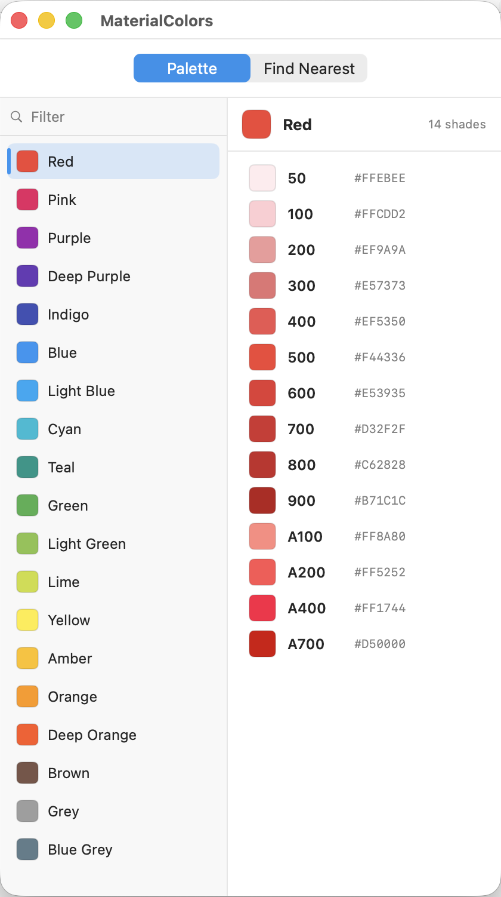

# MaterialColors

A small, fast, native macOS app for browsing the full Material Design color
palette, copying hex values, and finding the closest material colors to any
color you throw at it. Built with SwiftUI for Apple Silicon.

<p align="center">
  
</p>

## Features

### Browse the full Material palette
- All 19 Material Design 2014 color families — Red, Pink, Purple, Deep Purple,
  Indigo, Blue, Light Blue, Cyan, Teal, Green, Light Green, Lime, Yellow, Amber,
  Orange, Deep Orange, Brown, Grey, and Blue Grey.
- Every shade per family (50–900 plus the A100–A700 accents where they exist).
- A compact **vertical tab bar** lists the families down the left side, each with
  a color chip and name, so only the selected family's colors occupy the main
  area — keeping the window small.
- The selected family's colors are shown as a **tight vertical list**; the
  largest families (14 shades) fit on screen at once without scrolling.
- **Live filter** at the top of the sidebar narrows the family list as you type
  (matches family name, shade name, or hex).

### Copy hex values
- Click any color row (or family chip) to copy its hex value straight to the
  clipboard.
- A brief toast confirms what was copied.

### Find the nearest material colors
- Switch to the **Find Nearest** tab and enter a color as **hex**
  (`#F44336`, `F44336`, `#F00`) or **RGB** (`rgb(244, 67, 54)` or `244, 67, 54`).
- The app instantly shows the **3 closest material colors**, each with its name,
  hex value, a copy button, and the perceptual distance (ΔE).
- Matching is done in the **CIELAB** color space using CIE76 ΔE, so results line
  up with how the human eye perceives color difference rather than raw RGB math.
- **Search runs live** on every keystroke — no button to press.
- **Clipboard auto-fill**: when you open the Find Nearest tab, if the clipboard
  holds a valid color and the field is empty, it's pasted in and searched
  automatically. Copy a swatch on the Palette tab, switch over, and its nearest
  matches are already there.

### Native macOS behavior
- Compact default window sized to just what's needed.
- Closing the main window quits the app.
- App Sandbox enabled.

## Requirements

- macOS 14 (Sonoma) or later
- Apple Silicon (arm64)
- Xcode 16 or later to build

## Build and run

Open the project in Xcode and press Run:

```bash
open MaterialColors.xcodeproj
```

Or build from the command line:

```bash
xcodebuild -project MaterialColors.xcodeproj -scheme MaterialColors \
  -configuration Debug build
```

## Export a release bundle

```bash
xcodebuild -project MaterialColors.xcodeproj -scheme MaterialColors \
  -configuration Release \
  -derivedDataPath build/dd \
  CONFIGURATION_BUILD_DIR="$PWD/build/Release-export" build

# zip it for distribution
cd build/Release-export
ditto -c -k --sequesterRsrc --keepParent MaterialColors.app ../MaterialColors.zip
```

The exported build is **ad-hoc signed**. For distribution to other machines
you'll want to sign with a Developer ID certificate and notarize; otherwise
Gatekeeper will warn about an unidentified developer.

## Project layout

```
MaterialColors.xcodeproj
MaterialColors/
  MaterialColorsApp.swift    App entry, window setup, quit-on-close
  ContentView.swift          Palette / Find Nearest tab switch + toast
  ColorGridView.swift        Vertical family tab bar + shade list
  ColorFinderView.swift      Hex/RGB input, live nearest-color search
  MaterialPalette.swift      Full Material Design palette data
  ColorMath.swift            Hex/RGB parsing, CIELAB conversion, nearest search
  Clipboard.swift            NSPasteboard read/write helper
  Assets.xcassets            App icon + accent color
  MaterialColors.entitlements App Sandbox
docs/
  screenshot.png             Main window screenshot
```

## License

Licensed under the GNU General Public License v3.0. See [LICENSE](LICENSE).
